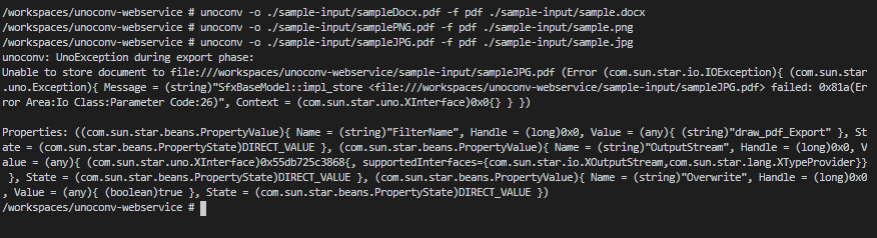
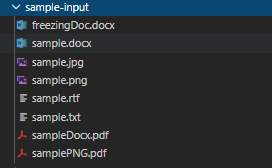

# teamparallax/unoconv-webservice

This project provides a webservice with a REST-API for file-conversions using unoconv.

## Prerequisites

In order to run the service locally `unoconv` and its dependencies (libreoffice, python3) need to be installed.
One can also run the service using docker, therefore `Docker` needs to be installed.

### Usage

You can either build the service from its source files or use the pre-built docker image from [Dockerhub](https://hub.docker.com/repository/docker/teamparallax/unoconv-webservice).

#### Building from source

If the above mentioned requirements are met one can run the service using the command:

```console
yarn run start
```

One can also build the webservice in a `docker` container by using the following command:

```console
# building the container image
yarn run build:docker

# running the container
yarn run start:docker
```

In order to provide `env` variables you have to one of the following things:

- create a new `.env` file with values for the webservice configuration variables.
- copy/rename `example.env` file and if needed adjust the values.

#### Using the built image

Or one could pull the image from [Dockerhub](https://hub.docker.com/repository/docker/teamparallax/unoconv-webservice) and run it afterwards by issueing this command

```console
# Pull the image, with a specified tag
docker pull teamparallax/unoconv-webservice:<TAG>

# Run the image
docker run \
    --name unoconv \
    -p 3000:3000 \
    teamparallax/unoconv-webservice
```

You can pass configuration variables for the webservice via docker `env` variables like below:

```console
# Pull the image, with a specified tag
docker pull teamparallax/unoconv-webservice:<TAG>

# Run the image
docker run \
    --env MAX_CONVERSION_RETRIES=<maxTries> \
    --env MAX_CONVERSION_TIME=<maxTime> \
    --name unoconv \
    -p 3000:3000 \
    teamparallax/unoconv-webservice
```

### Troubleshooting Conversions

In order to avoid erroneous or undesired results while using this webservice you (as user and/or maintainer) should notice that there is a **unoconv** bug with the conversions of images.
> Therefore it is **recommended** to wrap images in office documents to make the conversion work.
>
> In case of a usage with **Moodle** as client you can restrict file submissions to only accept several formats for an assignment.



Your respective output folder will contain two `.pdf` files after executing the three commands from screenshot above:



Description:

1. conversion with `.docx`: everything works fine, see [here](./sample-input/sampleDocx.pdf) (contains an image at the end of the file)
1. conversion with `.png`: `unoconv` does not signal any error or misbehaviour here, but looking at the "converted" file, you will see something like [below](#appendix-png-conversion-result)
1. conversion with `.jpg`: `unoconv` throws an error and exits the process with non-zero exit code and no output will be generated

### Swagger API

To see the API-documentation in development-environment one can go to `http://localhost:3000/#/api-docs`.

### Unowebconv moodle plugin

The current version of the webservice (`1.0.0`) works with moodle unowebconv plugin version `1.0.2`.
See the section below for further releases and corresponding information.

#### Minimum version requirements

| Webservice | Plugin |
| --- | :---: |
| `0.4.2` | `1.0.2` and previous |
| `0.5.0` | `1.0.2` and previous |
| `0.5.3` | `1.0.2` and previous |
| `0.5.4` | `1.0.2` and previous |
| `0.5.5` | `1.0.2` and previous |
| `1.0.0` | `1.0.2` |

---

### Appendix PNG conversion result


